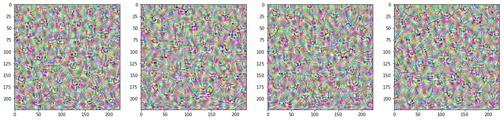

## Interpretable CNNs

The goal of the project is to develop a small toolkit that will be useful to analyze CNN model and gain more insights about how model is working.


### Project structure

We have packaged a few visualisation algorithms into class that is able get different visualisation from VGG network. (```ClassifierExplainer```)

We have trained an example neural network on CelebA dataset to classify Smiling/Not Smiling people. 

### Example Visualisations (viz_demo.ipynb)

|Image source                 |Image                   |
|:---------------------------:|:----------------------:|
|Original image               | |
|Heatmap of activations       ||
|Smoothed gradient            ||
|Last layer filter patterns   ||
|Image after last layer filter||
|Image after 1st layer filter ||

## Running locally 
All visualizations are located in the `vis_demo.ipynb` notebook.

Before running check [Virtualenv](https://docs.python-guide.org/dev/virtualenvs/) manual

```
#Create virtualenv (Run in project folder)
virtualenv --python=python3 .env

#Activate environment
source .env/bin/activate

#Install packages (with activated env)
pip install -r requirements.txt
```

[Celeba dataset](https://www.kaggle.com/jessicali9530/celeba-dataset) is used for training and evaluation.

To download dataset use:
```
kaggle datasets download -d jessicali9530/celeba-dataset 
```

## References

[Repository with visualisation algorithms](https://github.com/utkuozbulak/pytorch-cnn-visualizations)